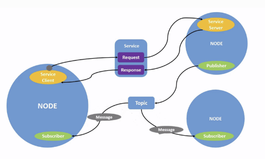

# Robotic-Tools

Robotic-Tools is a collection of tools, examples and small projects developed and during a robotics project group at the Rheinische-Friedrich-Wilhelms-Universität Bonn (specifically this [course](https://www.ais.uni-bonn.de/SS/PG_Mobile_Robotik.html) by Dr. Nils Goerke).

Disclaimer: This is not an official repository of the university, but merely a collection of things I deemed useful during the course. The tools are not guaranteed to be correct or complete, but I will try to keep them up to date and fix bugs.

## ROS Basics Overview

(A collection of notes regarding useful commands and concepts in ROS2 that I needed during the course)

ROS2 Jazzy:

- ```source /opt/ros/jazzy/setup.bash``` -> to set up the ros environment (This enables the use of ROS2 commands)
- ```ros2 run <package> <executable>``` -> to run a specific executable from a package
- ```ros2 topic list``` -> to list all active topics

Setup for this repository:

- ```source /opt/ros/jazzy/setup.bash``` -> to set up the ros environment to use ROS2 core as **underlay** (so ros2 finds standard packages)
- ```colcon build --symlink-install``` -> to build my packages
- **Change to a different terminal** and run:
- ```source install/setup.bash``` -> to set up the ros environment to use my packages as **overlay** (so ros2 finds my packages)
- ```ros2 run roboto <executable>``` -> to run a specific executable from my package

--------

## Installing Stage for ROS2

Installation of stage_ros2 on Ubuntu 24.04:

- Update the needed development packages and tools:
  
  - ```bash
      sudo apt-get install git cmake g++ libjpeg8-dev libpng-dev libglu1-mesa-dev libltdl-dev libfltk1.3-dev
    ```

  - install FLTK of version 1.3 instead of 1.1 here

- Install stage as dependency for the stage_ros2 bridge: (only works manually on Ubuntu 24.04)
  
  - ```bash
      cd YOUR_ROS2_WORKSPACE && mkdir src && cd src
      git clone --branch ros2 https://github.com/tuw-robotics/stage.git
      cd stage
      mkdir build && cd build
      cmake ..
      make # <- this will take a while or use -j<number_of_cores> to speed it up (not recommended on wsl2)
      sudo make install # <- will install the needed cmake files for us
    ```

- Make sure stage_ros2 finds the stage installation:

  - ```bash
      export CMAKE_PREFIX_PATH=/usr/local/lib/cmake:$CMAKE_PREFIX_PATH # <- this might be different on your system or not needed when installing in the same workspace
    ```

- Install stage_ros2: Either as a submodule or as a normal git clone:

  - ```bash
      cd YOUR_ROS2_WORKSPACE/src 
      git clone --branch humble git@github.com:tuw- robotics/stage_ros2.git
      cd YOUR_ROS2_WORKSPACE
    ```

  - or as a submodule:

    - ```bash
      cd <workspace>/src
      git submodule add --branch humble git@github.com:tuw-robotics/stage_ros2.git stage_ros2
      ```

- Make sure the python ros development tools are installed:

  - ```bash
      cd YOUR_ROS2_WORKSPACE
      sudo apt install python3-rosdep
      sudo rosdep init
      rosdep update
      rosdep install --from-paths src --ignore-src -r -y # this installs all missing dependencies of your pkgs
    ```
  
- Build the workspace:

  - ```bash
       colcon build --symlink-install --cmake-args -DOpenGL_GL_PREFERENCE=LEGACY
       colcon build --symlink-install --packages-select stage_ros2
    ```

- Source Workspace and run the stage_ros2 example:

  - ```bash
      source install/setup.bash
      ros2 launch stage_ros2 stage.launch.py world:=cave enforce_prefixes:=false one_tf_tree:=true
    ```

Full example of the stage_ros2 example:

```bash
# Install dependencies
sudo apt-get install git cmake g++ libjpeg8-dev libpng-dev libglu1-mesa-dev libltdl-dev libfltk1.3-dev

# Build and install stage
cd YOUR_ROS2_WORKSPACE
mkdir src 
cd src
git clone --branch ros2 git@github.com:tuw-robotics/stage.git
cd stage
cmake -S . -B build
cd build
make
sudo make install # install cmakefiles
export CMAKE_PREFIX_PATH=/usr/local/lib/cmake:$CMAKE_PREFIX_PATH # not needed when installing in the same workspace

# Install stage_ros2
cd YOUR_ROS2_WORKSPACE/src
git clone --branch humble git@github.com:tuw-robotics/stage_ros2.git 
cd YOUR_ROS2_WORKSPACE

# Update the needed development packages and tools
sudo apt install python3-rosdep
sudo rosdep init
rosdep update
rosdep install --from-paths src --ignore-src -r -y  # this installs all missing dependencies of your pkgs

# Build the workspace
colcon build --symlink-install --cmake-args -DOpenGL_GL_PREFERENCE=LEGACY
colcon build --symlink-install --packages-select stage_ros2        
```
  
### ROS Concepts



(Image taken from [ROS2 Tutorial](https://docs.ros.org/en/jazzy/Tutorials/Beginner-CLI-Tools/Understanding-ROS2-Nodes/Understanding-ROS2-Nodes.html))

--------

**Nodes** &rarr; responsible for **single, modular tasks**
-

## Lidar Helpers

The `lidar_helpers.h` header provides a set of utility functions and strongly-typed classes for working with laser-based distance measurements and angle conversions in robotics applications. The library is designed to make calculations involving laser travel time, distances between laser beams, and conversions between different angle representations (radians, degrees, and laser numbers) type-safe and easy to use.

### Main Functions

#### 1. `DistanceToTime`

```cpp
double DistanceToTime(const double& distance);
```

**Description:**  
Calculates the time (in seconds) it takes for a laser to travel a given distance (in meters) through air.

---

#### 2. `DistBetweenLasersM`

```cpp
double DistBetweenLasersM(double dist_of_lasers_m, double laser_deg = internal::ANGLE_OF_LASER_DEGREE);
```

**Description:**  
Calculates the distance between two lasers (originating from the same source) after traveling a specified distance, given the angle between them.

**Example:**

```cpp
double separation = roboto::DistBetweenLasersM(5.0);
```

---

#### 3. `DistToLaserSeparationM`

```cpp
double DistToLaserSeparationM(double dist_bet_lasers_m, double laser_deg = internal::ANGLE_OF_LASER_DEGREE);
```

**Description:**  
Calculates how far two lasers must travel before they are a specified distance apart, given the angle between them.

**Example:**

```cpp
double distance = roboto::DistToLaserSeparationM(0.05);
```

---

### Angle Types

The library provides three strongly-typed angle classes:

- `RadianType` — represents an angle in radians.
- `DegreeType` — represents an angle in degrees.
- `LaserNumType` — represents a laser number (e.g., for a multi-beam lidar).

These types support arithmetic, comparison, and explicit conversion between each other.

#### Example: AngleType Conversions

```cpp
#include "roboto/lidar_helpers.h"

using namespace roboto;

// Create from double
RadianType rad(M_PI / 2);
DegreeType deg(90.0);
LaserNumType num(180.0);

// Convert between types
DegreeType deg_from_rad(rad);      // 90.0 degrees
RadianType rad_from_deg(deg);      // M_PI/2 radians
LaserNumType num_from_deg(deg);    // laser number corresponding to 90 degrees

// Back conversion
DegreeType deg2(num_from_deg);     // Should be 90.0 degrees

// Access raw value
double radians = rad.value();
double degrees = deg.value();
double laser_number = num.value();
```

#### Example: Using `LaserPosType`

`LaserPosType` is a simple struct that holds all three representations for a given angle:

```cpp
LaserPosType pos_from_rad(RadianType(M_PI / 4));
std::cout << "Laser #: " << pos_from_rad.num
          << ", Degrees: " << pos_from_rad.deg
          << ", Radians: " << pos_from_rad.rad << std::endl;
```

---

### Notes

- All conversions between angle types are explicit and type-safe.
- Arithmetic and comparison operators are supported for all angle types.
- The library relies on constants and conversion functions defined in `roboto/internal/config.h` and `roboto/internal/conversions.h`.

For more details, see the [API documentation](include/roboto/lidar_helpers.h) or the unit tests in `test/lidar_helpers_test.cpp`.

## Tools

/// TODO: Update these example outputs to showcase that length measurements are in meters not cm

**Time-Difference of Lasers**:

```roboto timedif <distance1> <distance2>```

- Calculates the time a laser needs to travel a certain distance and the difference in time between two lasers

- example:

  - ```bash
    roboto timedif 7.5 7.35
    ```

- output:

  - ```bash
     Time for Distance 1: 25.0248 ns
     Time for Distance 2: 24.5243 ns
     Difference in Time: 0.500496 in ns
     ```

-------

**Distance between two lasers dependent on distance to source**:

```roboto distoflaser <arg1> <arg2> ...```

- Calculates the relative distance between two lasers depending on the distance to the source based on the angle between them (here 0.5°)
- example:

  - ```bash
    roboto distoflaser 3.5 5 7.5
    ```

- output:

  - ```bash
    Distance of laser (m)    | Distance Between lasers (m)
    3.50                     | 3.05
    5.00                     | 4.36
    7.50                     | 6.54
    ```

Inverse option:

```roboto distoflaser -i <arg1> <arg2> ...```

- Calculates how far after the source the distance between the lasers is arg1...n

- example:

  - ```bash
    roboto distoflaser -i 6 7.5
    ```

  - output:

  - ```bash
    Distance Between lasers (m)     | Distance from laser (m)
    6.00                             | 6.88
    7.50                             | 8.59
    ```

------

**Conversion Between Laser number, Degrees and Radians**:

```roboto laserpos <value> <num|rad|deg>```

- Converts between laser number, degrees and radians
- example:

```bash

laserpos -89.3 deg
Lazer Number     | Degree        | Radian
----------------------------------------
91               | -89.300       | -1.559
----------------------------------------

laserpos 91 num

Lazer Number     | Degree        | Radian
----------------------------------------
91               | -89.500       | -1.562
----------------------------------------
```
